```{julia}
# ENV["GKSwstype"] = "png"
using CairoMakie, Glob, LaTeXStrings, NPZ, PyFormattedStrings 
# gr()
set_theme!() # remove the default theme so get rid of resolution issue

big_texfonts = merge(Theme(fontsize=24), theme_latexfonts())
set_theme!(big_texfonts)

cmap = :turbo

data_folder = "output/data/2D/"
bw_data = data_folder*"blast_wave/"
br_data = data_folder*"ring/"
kh_data = data_folder*"kh/"

function load_frame(file)
    data = npzread(file)
    V = data["V"]
    rho = V[1, :, :]
    rho = permutedims(rho)
    x = data["x1"]
    y = data["x2"]
    return x, y, rho
end

function plot_rho(file, 
                  name,
                  interval,
                  frame_num;
                  size=(800, 800),
                  scale=1.0,
                  cmap=:inferno,
                  crange=(0.08, 6.5)
                  )
    x, y, rho = load_frame(file)

    fig = Figure(; size=size.*scale)
    ax = Axis(fig[1,1], 
            xlabel=L"x",
            ylabel=L"y",
            aspect=DataAspect(),
            title=f"{name} Density at t={frame_num*interval:.2f} s"
            )
    hm = heatmap!(ax, x, y, rho,
            colormap=cmap,
            colorrange=crange,
            )
    Colorbar(fig[1, 2], hm, label=L"\rho")
    fig
end;
```

# 1D Problem

First I corrected the error with saving the simulation data from
the `_write_numpy` function in `output.py`.
This error came from the line

```{.python}
np.save(self._file_name, (V, g.x1))
```

This error was caused by the fact that `V` has shape $(3, 514)$ and `g.x1` has shape $(514,)$.
`numpy` is not able to convert these shapes into a single array.
The simple solution was to use the numpy function `np.savez(self._file_name, V=V, x1=g.x1)`.
This function allows numpy to save the data despite having different shapes.
I then modified the `plot_1d.py` function to read the `.npz` files.

As well just a little change there was an issue with the files being read in by `plot_1d.py` not sorted.
This lead to the plots showing different simulation snapshots and in the wrong order.
I replaced that with `files = sorted(glob.glob(f"{data_path}*.npz"))`.
I used `glob` as it is an easy way to grab all files that follow a specific pattern.

## Reconstruction

### Flat Reconstruction
I first implemented the "flat" or Nearest Neighbors reconstruction algorithm.

```{.python}
# Return the neighboring values directly
L = V[:, :-1]
R = V[:, 1:]
```

### Linear Reconstruction
Once I confirmed that flat reconstruction worked, I implemented the "linear"
reconstruction algorithm.

I implemented the slope-limiter using `np.where()` this function
makes it easy to implement the logic of the $\mathrm{minmod}$ algorithm.

$$
\Delta \overline{V} = 
\mathrm{minmod}(
\vec{V}_{i} - \vec{V}_{i-1},
\vec{V}_{i+1} - \vec{V}_{i}
)
$$

```{.python}
# "Left" difference
delta_minus = V[:, 1:-1] - V[:, :-2]
# "Right" difference
delta_plus = V[:, 2:] - V[:, 1:-1]
```

$$
\mathrm{minmod}(a,b) = 
\begin{cases}
a, \qquad \text{if } |a| < |b| \text{ and } a \cdot b > 0 \\ 
b, \qquad \text{if } |a| > |b| \text{ and } a \cdot b > 0 \\
0, \qquad \text{else} 
\end{cases}
$$

```{.python}
delta_V = np.where(
        delta_minus * delta_plus > 0.0, # if a * b > 0.0
        np.where(
            np.abs(delta_minus) < np.abs(delta_plos),
            delta_minus, # return the value of a if |a| < |b|
            delta_plus   # return the value of b if |a| > |b|
        ),
        0.0 # otherwise, a * b < 0.0, return 0.0
    )
```

$$
\vec{V}^{n}_{\pm} = \vec{V}^{n} \pm \frac{\Delta \overline{V}}{2}
$$

$$
\vec{V}^{n}_{L} \quad \vec{V}^{n}_{R}
$$

It took me a while to understand how the boundary conditions
were used within the program.
Eventually I recognized that I was returning the "cell-centered"
values rather than the values at the interface.
Because of this I needed to slice one more value from each edge to 
align with the expected shape.

```{.python}
# Calculate the values at the interface of the cells
L = V[:, 1:-2] + 0.5 * delta_V[:, :-1]
R = V[:, 2:-1] - 0.5 * delta_V[:, 1:]
```

I then ran the 1D problem using the linear method which lead to 
some unexpected results which are discussed in @sec-model-compare

## Time-Stepping

### Euler Method 

I first implemented the Euler time-stepping method.

$$
y_{n+1} = y_{n} + f(y_{n}) \Delta t
$$

The specific form used in this problem is:

$$
\vec{U}^{n+1} = \vec{U}^{n} + \frac{\Delta t}{\Delta x} \vec{\mathcal{L}}^{n}
$$

```{.python}
# Euler Method
U_new = U + dt * RHSOperator(U, grid, algorithms, timing) / dx
# Apply boundary conditions
grid.boundary(U_new, parameters)
```

### 2^nd^ Order Runge-Kutta 
Once I confirmed that the Euler time-stepping worked without error,
I implemented the 2nd Order Runge-Kutta (RK2) time-stepping algorithm.

\begin{align*}
k_1 &= f(y_n) \\
k_2 &= f(y_n+k_1 \Delta t) \\
y_{n+1} &= y_n + \left(\frac{k_1 + k_2}{2}\right)\Delta t
\end{align*}

\begin{align*}
\vec{U}^{*} &= \vec{U}^{n} + \frac{\Delta t}{\Delta x} \vec{\mathcal{L}}^{n} \\
\vec{U}^{n+1} &= \frac{1}{2} \left( \vec{U}^{n} + \vec{U}^{*} + \frac{\Delta t}{\Delta x} \vec{\mathcal{L}}^{*} \right)
\end{align*}

```{.python}
# 2nd Order Runge-Kutta
# Calculate the intermediate state 
U_temp = U + dt * RHSOperator(U, grid, algorithms, timing) / dx
# Apply boundary conditions 
grid.boundary(U_temp, parameters)
# Based on the past and intermediate state calculate the new state 
U_new = 0.5 * (U + U_temp + dt * RHSOperator(U_temp, grid, algorithms, timing) / dx)
# Apply boundary conditions 
grid.boundary(U_new, parameters)
```
However once I implemented RK2 I ran into some difficulties.
When comparing my simulation to the model solution, the simulation with RK2
deviated from the solution where Euler had not.
This caused a lot of confusion as RK2 is a 2^nd^ order scheme and thus should be more accurate than Euler integration.

### 4^th^ Order Runge-Kutta 
After implementing RK2 I wanted to implement the 4^th^ order Runge-Kutta (RK4) integration.
I understood the method to calculate the intermediate timesteps from RK2.
Thus I extended RK2 to calculate the 4 intermediate steps needed for RK4.

\begin{align*}
k_1 &= f(y_n, t_n) \\
k_2 &= f(y_n+k_1 \Delta t/2, t_n + \Delta t / 2) \\
k_3 &= f(y_n+k_2 \Delta t/2, t_n + \Delta t / 2) \\
k_4 &= f(y_n+k_3 \Delta t, t_n + \Delta t) \\
y_{n+1} &= y_n + \left(
\frac{k_1}{6} + 
\frac{k_2}{3} + 
\frac{k_3}{3} + 
\frac{k_4}{6}
\right)\Delta t
\end{align*}

See the source code for my implementation of RK4.

## Comparison to Model {#sec-model-compare}

The simulation that was best able to recreate the model solution was using the Euler Method and Flat Reconstruction.
@fig-euler_end shows the final image of the simulation.
@fig-rk4_end shows the final frame of the 1D simulation using RK4 and linear reconstruction.
The "more advanced" methods were not able to recreate the model solution as well
as the simpler methods.
This is likely due to the nature of the problem we are simulating.
The linear reconstruction method makes the features a bit "sharper",
with smaller transition regions between the various features.

::: {#fig-shock-tube layout-ncol=2}

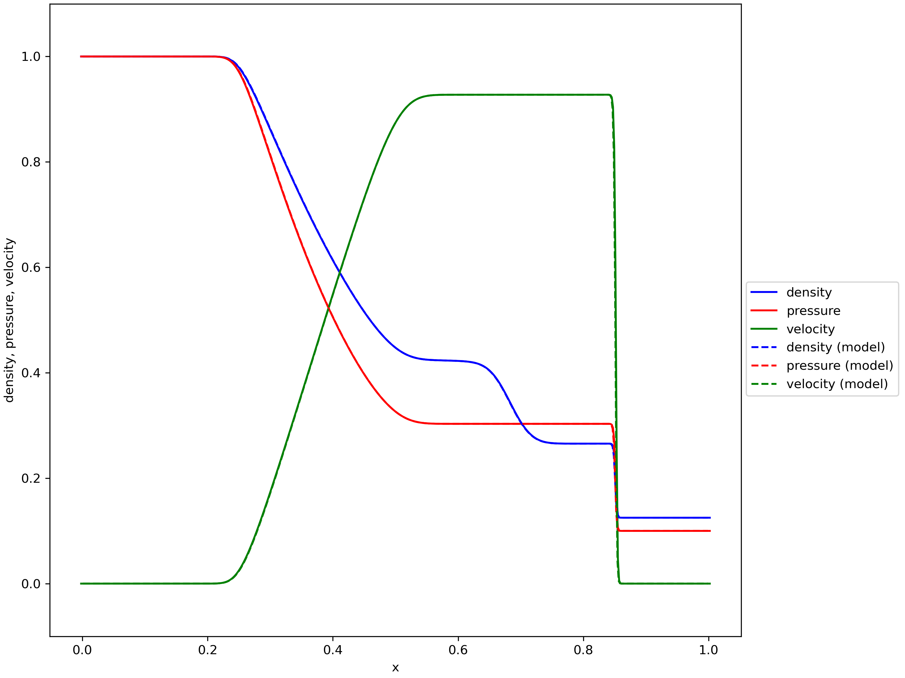{#fig-euler_end}

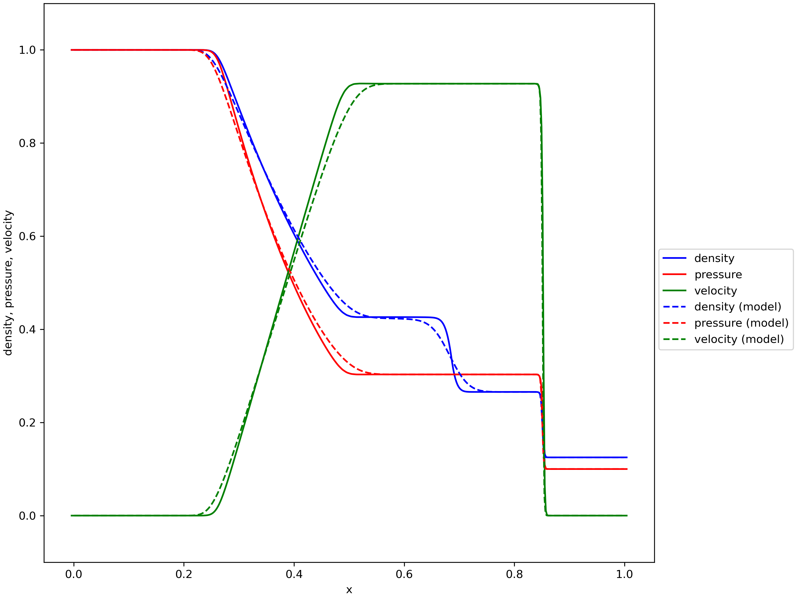{#fig-rk4_end}

Comparison of shock tube simulation results using various methods.
:::

Given that I was able to recreate the model solution I moved on to 
the 2D simulations.

# 2D Problems

## Blast Wave Example
The first simulation was the Blast Wave problem described in the 
detailed project instructions. I changed the problem parameters to be:

- $-0.5<x<0.5$, $-0.75<y<0.75$
- Resolution: $400 \times 600$
- Boundary conditions are reciprocal everywhere.

These changes were motivated by the Athena Code Test "Spherical Blast Wave"
example.
I wanted to compare the blast wave example to the Athena example 
however there were issues with that which are discussed in @sec-blast-ring.
If the boundary conditions were "outflow" we would not get complex 
interactions between the waves in the fluid and the blast would only spread out.
As well by changing the dimensions of $x$ and $y$ this leads to 
differences between the vertical and horizontal directions.

```{julia}
bw_init = bw_data * "data_2D_0000.npz"

bw_init_plot = plot_rho(bw_init,
        "Blast Wave",
        2e-3,
        0,
        ;size=(600, 700),
        cmap=cmap,
        crange=(0.08, 6.5)
        )
save("images/bw_init.png", bw_init_plot)
```


```{julia}
# File that corresponds to 0.2 seconds 
file = bw_data * "data_2D_0100.npz"

bw_02_plot = plot_rho(file,
        "Blast Wave",
        2e-3,
        100,
        ;size=(600, 700),
        cmap=cmap,
        crange=(0.08, 6.5)
        )
save("images/bw_02.png", bw_02_plot)
```


```{julia}
# File that corresponds to 0.2 seconds 
file = bw_data * "data_2D_0750.npz"

bw_final_plot = plot_rho(file,
        "Blast Wave",
        2e-3,
        750,
        ;size=(600, 700),
        cmap=cmap,
        crange=(0.08, 6.5)
        )
save("images/bw_final.png", bw_final_plot)
```

::: {#fig-blast-wave-time layout-ncol=3 width=50%}

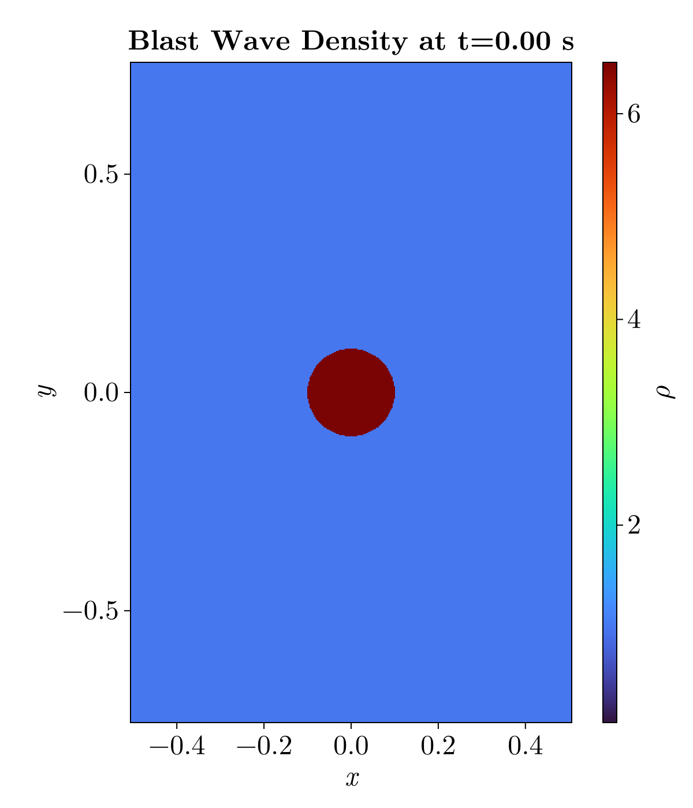{#fig-blast-wave-init}

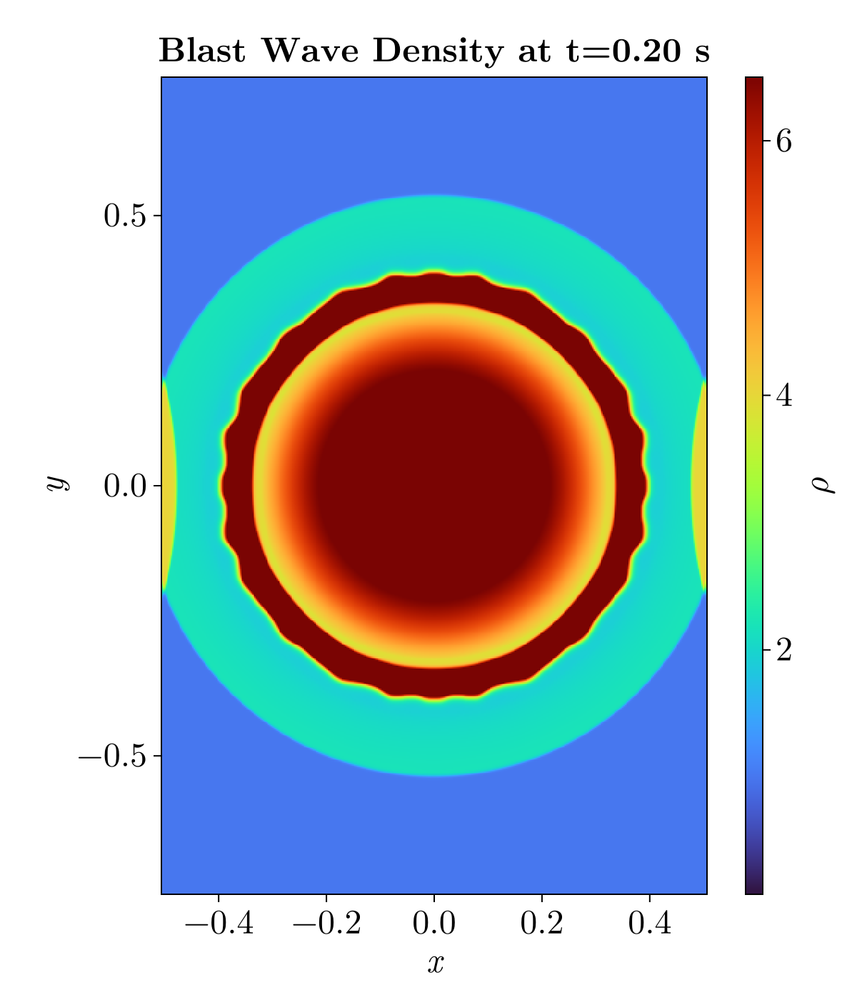{#fig-blast-wave-02}

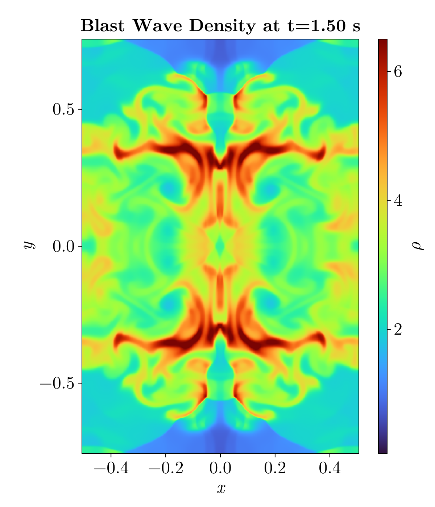{#fig-blast-wave-end}

The blast wave simulation at various times.
:::

### Plotting Method

I created `plot_2d.py` by copying `plot_1d.py` and modifying it.
First by adding in multiple subplots that showed the different variables.
This was a useful method to ensure that the initial conditions of the 
problem were set correctly.
I used `pcolormesh` to display the images as I am more familiar with 
that plotting method than `imshow`.
However, eventually I switched over to plotting in Julia when making the animations.
Julia provides some very useful plotting features for videos as discussed in @sec-anim

## Custom Problems

Another change that I made was to save the data and plots based on the `Name` problem parameter.
When switching between the custom problems there were issues with the new problems overwriting old data and plots.
By using the name parameter in this way each problem is saved to a unique location.
I changed `output.py` script to use the `Name` of the problem as another directory for the output folders.

I created two custom 2D simulations.
The first was a recreation of the Athena Code Test "Spherical Blast Wave".
The second was a recreation of the Athena Code Test "Kelvin-Helmholtz Instability".

### Blast Ring {#sec-blast-ring}

This problem is a variation on the initial blast wave problem.
When comparing the blast wave Athena Code Test I noticed some discrepancies
between the stated initial conditions and the provided demonstration.
As @fig-athena-blast-init shows the initial conditions for the Athena
simulation were not an initial overdensity within $r<0.1$.


Instead the simulation starts from a ring at $r=0.1$ with the overdensity.
I was able to implement this by creating a mask around $r=0.1$ and setting
the overdensity there.
After some experimenting I found that a ring with width $\Delta r = 0.005$
reasonably recreated the Athena simulation.
@fig-blast-ring-init shows this initial setup.

```{julia}
file = br_data * "data_2D_0000.npz" 

br_init_plot = plot_rho(file,
        "Blast Ring",
        2e-3,
        0,
        ;size=(600, 700),
        cmap=cmap,
        crange=(0.08, 6.5)
        )
save("images/br_init.png", br_init_plot)
```

::: {#fig-br-compare-init layout-ncol=2}

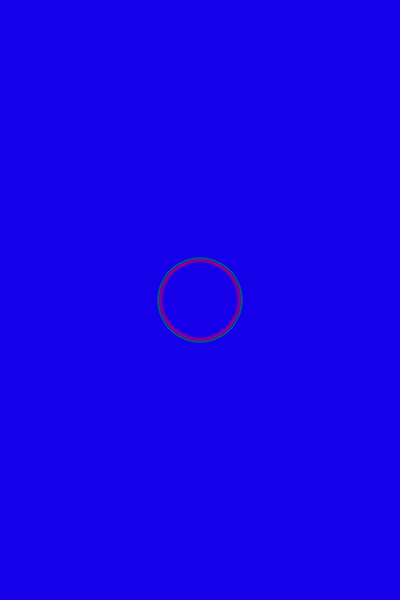{#fig-athena-blast-init width=70%}

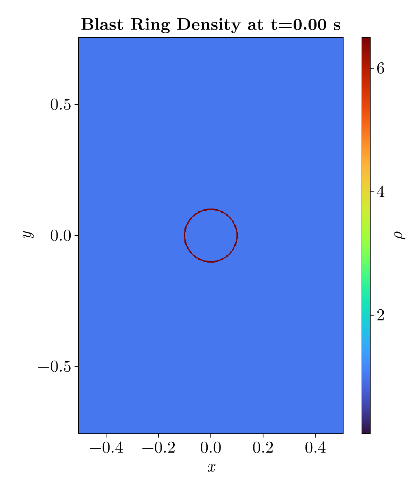{#fig-blast-ring-init}

The initial conditions of the blast ring simulation.
:::

The main comparison for this problem is the creation of "fingers"
within the fluid that do not dissipate after creation.
As well as the density being symmetric horizontally and vertically
throughout the simulation.

```{julia}
file = br_data * "data_2D_0100.npz" 

br_02_plot = plot_rho(file,
        "Blast Ring",
        2e-3,
        100,
        ;size=(600, 700),
        cmap=cmap,
        crange=(0.08, 6.5)
        )
save("images/br_02.png", br_02_plot)
```

::: {#fig-br-compare layout-ncol=2 width=50%}

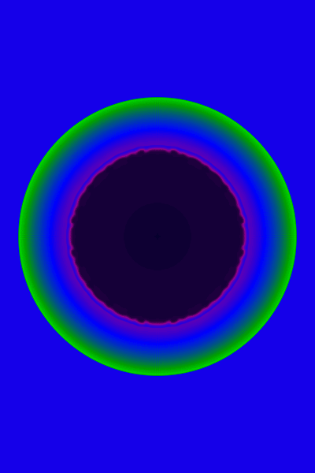{#fig-athena-blast-t02 width=70%}

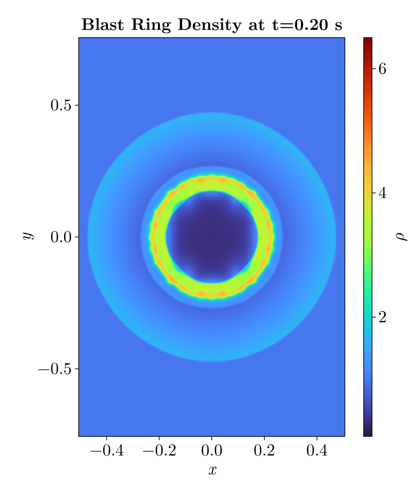{#fig-blast-ring-t02}

Comparison of Athena simulation and my simulation at $t=0.2$s.
:::

### Kelvin-Helmholtz

For the second custom problem I decided to look at the Kelvin-Helmholtz Instability.
This was mentioned in the lectures and produced beautiful videos.
The initial conditions I used were based on the Athena Code Test.

- $-0.5 < x < 0.5$, $-0.75 < y < 0.75$
- Resolution: $512 \times 512$
- Pressure: $2.5$ everywhere
- $|y| > 0.25$ has density $1.0$ and $v_{x}=-0.5$
- $|y| < 0.25$ has density $2.0$ and $v_{x}=0.5$
- $v_{y} = 0.0$ everywhere
- Reciprocal boundary conditions everywhere

However with just these initial conditions the instabilities did not form.
I had missed an important line in the initial conditions: 

::: {.callout-note title="Kelvin-Helmholtz Initial Condition"}
To seed the instability, we add random numbers to both the 
x- and y-components of the velocity
with peak-to-peak amplitude of $0.01$.
:::

Without these random velocities the instabilities did not form and the
flow continued smoothly.
@fig-kh shows the initial conditions of the Kelvin-Helmholtz Instability.
While it is not visible in the $v_{x}$ subplot the $v_{y}$ subplot shows 
the initial random velocities.

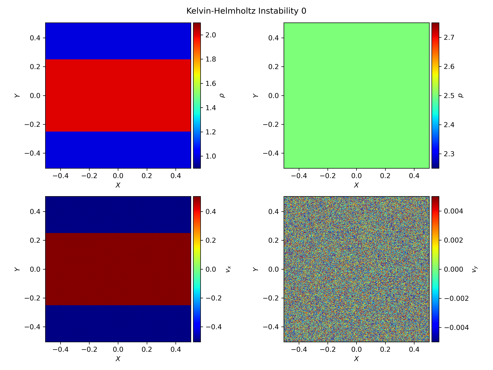{#fig-kh}

Initially I ran this simulation for a simulation time of $t=1.0$s.
However the instabilities were just beginning to form,
unlike in the Athena code test where the instabilities were already visible at one second, see @fig-kh-compare. 

```{julia}
file = kh_data * "data_2D_0100.npz" 

kh_1_plot = plot_rho(file,
        "Kelvin-Helmholtz",
        1e-2,
        100,
        ;size=(800, 800),
        cmap=cmap,
        crange=(0.9, 2.1)
        )
save("images/kh_1_plot.png", kh_1_plot)
```
::: {#fig-kh-compare layout-ncol=2 width=50%}

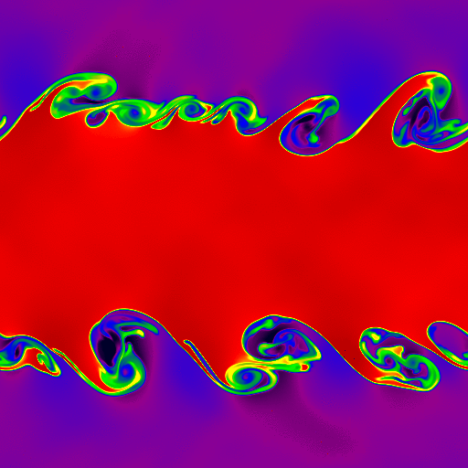{#fig-athena-kh-1 width=85%}

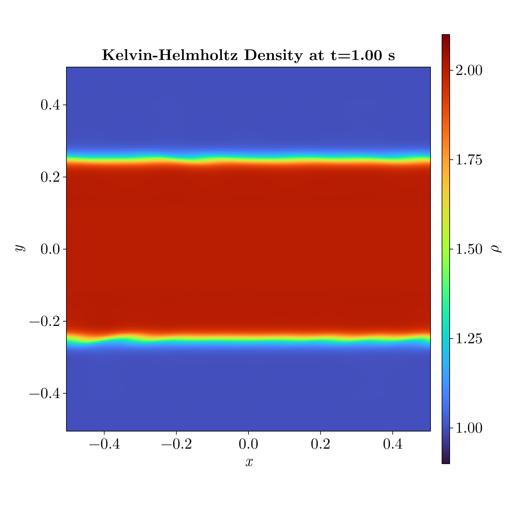{#fig-kh-t1}

Comparison of Kelvin-Helmholtz Simulations at $t=1.0$s of simulation time.
:::

But as it seemed the instabilities were forming I decided to increase
the max time parameter to five seconds to match the Athena simulation.
Increasing the simulation time made the simulation take approximately 2.5 hours,
using the linear reconstruction method and RK4.
@fig-kh-t2 shows the instabilities forming at two seconds. 

```{julia}
file = kh_data * "data_2D_0200.npz" 

kh_2_plot = plot_rho(file,
        "Kelvin-Helmholtz",
        1e-2,
        200,
        ;size=(800, 800),
        cmap=cmap,
        crange=(0.9, 2.1)
        )
save("images/kh_2_plot.png", kh_2_plot)
```

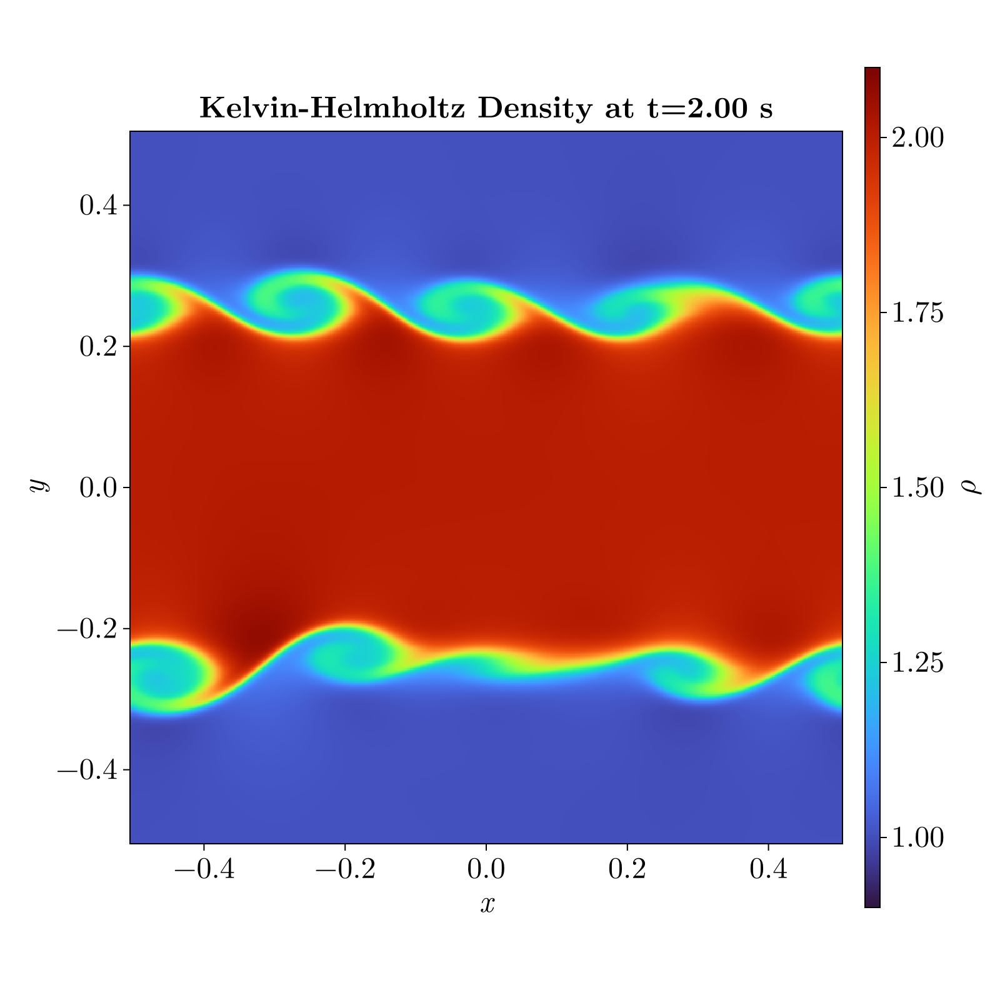{#fig-kh-t2 width=50%}

The simulation does achieve the expected instabilities.
However when comparing to the Athena code test there is a lack 
of detail.
There are a few potential reasons for these differences.
The main one comes from Athena using more advanced solvers that 
preserve those small details.
The linear reconstruction method is not able to retain those small 
vortices. 
As well Athena used the "hllc" Riemann solver while this simulation 
used "hll". 
From what I have seen the hllc solver utilizes a more
accurate model of the waves which retains that extra detail.

# Animation {#sec-anim}
I attempted many methods for animating the results:

- FFmpeg to convert the generated plots to a .mp4 file.
- yt-project to make the plots and then stitch them together with FFmpeg.
- `matplotlib.animation` library to automatically make the video
- julia plotting as making animations is very easy
  - animating with the `@animate` macro using `Plots`
  - animating using `Observables` and `CairoMakie`

The method that I eventually settled on was to make the animations
in Julia using the CairoMakie package.
This package makes use of `Observables` that are variables
that julia monitors and uses the GPU to change in place.
This method make videos faster than
the standard method from matplotlib or making the frames 
individually and stitching them together.

At first I just plotted the densities using a heatmap
to ensure that the videos were generating properly.
Once that was confirmed to work I included the other variables
pressure, $p$, and the velocity fields.

The velocity animation took the longest to make work.
Initially I wanted to use streamlines to show the velocity flow.
However when attempting this in both python and julia there were 
a few issues. 
The main one being that the streamlines between frames were not 
consistent.
So the video did not provide an understanding of how the flow 
changes over time.
I changed from using streamlines to using `arrows2d` which is 
equivalent to matplotlibs `quiver` function.
This shows the velocity field over time and by sampling 
specific points within the velocity field it was consistent.

The pressure was made using the same heatmap method as for the 
density but with a different colorscale.
At first I set the pressure colorscale based on the 
density colorscale and dividing by the value of $\gamma$ used 
in that simulation.
This generally worked but did not provide all the detail I wanted,
so eventually I just tried different values to reveal more detail.

For the animation of the Kelvin-Helmholtz problem I wanted to see 
the formation of larger vortices so I increased the simulation time 
to 10 seconds. 
This took approximately six hours to run using linear reconstruction 
and RK4.
The vortices did grow over time as @fig-kh-final shows the last frame
of the simulation.


```{julia}
file = kh_data * "data_2D_1000.npz" 

kh_final_plot = plot_rho(file,
        "Kelvin-Helmholtz",
        1e-2,
        1000,
        ;size=(800, 800),
        cmap=:inferno,
        crange=(0.9, 2.1)
        )
save("images/kh_final_plot.png", kh_final_plot)
```

# Conclusion

This was a interesting project allowing us to dive deeper into
computational fluid dynamics (CFD).
CFD is a topic I have wanted to explore for a while but have not had 
the chance to before.
It was useful to focus on just a few aspects of the code but
being able to see how the various parts of the simulation fit together.
I have certainly gained a deeper understanding and appreciation of 
what it takes to develop a computational fluid dynamics system.
As well it was fun making my own simulations and producing beautiful
plots and movies.

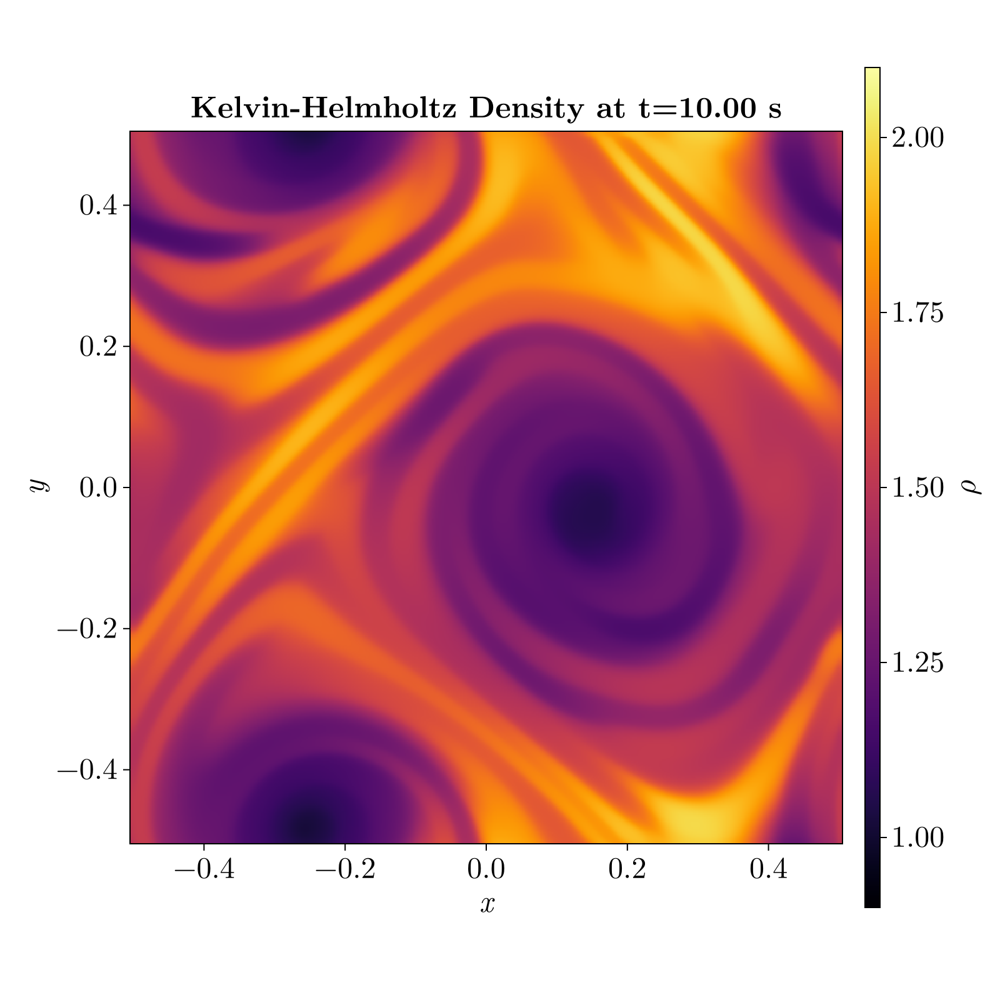{#fig-kh-final}


::: {#fig-blast-wave-anime .content-visible when-format="html"}


Blast Wave Animation
:::

::: {#fig-ring layout-ncol=2 .content-visible when-format="html"}


{width=70%}

Blast Ring
:::

::: {#fig-kh-anim layout-ncol=2 .content-visible when-format="html"}


{width=85%}

Kelvin-Helmholtz Instability
:::
