# The Orbit Integrator Scheme
The first part of the project was to create a program that 
is able to integrate the orbit of a star in three parts:

1. Driver (orbit driver)
2. Integrator(s) (to advance the star to the next state)
3. Acceleration (to calculate the acceleration from the state)

## Acceleration due to a Potential 

The first part that I tackled was to create a function to calculate
The force experienced by a star orbiting a point mass.
The acceleration due to this point mass is given by:

\begin{equation}
\vec{a} = 
\frac{d\vec{v}}{dt} = 
\frac{\vec{F}}{m} = 
- \frac{M_{\mathrm{ptmass}}}{r^3} \vec{r}
\label{eq:eq-ptmass}
\end{equation}

Given this we can write a function for this acceleration 

```{.julia}
function f(t, state)
    pos, vel = state 
    acc = - G * M * pos / norm(pos)^3 
    return [vel, acc]
end
```
This function makes use of the dynamic form of Ordinary Differential 
Equations as discussed in @Landau2024_comp_phys chapter 8.

\begin{equation}
\frac{d \mathbf{S}(t)}{dt} = \mathbf{F}(t, \mathbf{S})
\label{eq:eq-ode}
\end{equation}

Where the state of the system, and the force applied to it, are defined as:

\begin{equation}
\mathbf{S} =
\begin{bmatrix}
    S^{(0)}(t) \\
    S^{(1)}(t) \\
    \ddots \\
    S^{(N-1)}(t) \\
\end{bmatrix}, \qquad 
\mathbf{F} =
\begin{bmatrix}
    F^{(0)}(t, \mathbf{S}) \\
    F^{(1)}(t, \mathbf{S}) \\
    \ddots \\
    F^{(N-1)}(t, \mathbf{S}) \\
\end{bmatrix}.
\label{eq:eq-ode-def}
\end{equation}

That is to say that the state of the system is defined by an $N$-dimensional
vector and the force that acts on the system is also an $N$-dimensional
vector.
I had some difficulty combining this with the vector version of 
the force equations that I prefer to use. 
Using the vector versions allows us to not have to track $x, y, z, v_x, v_y, v_z$, etc.
individually. Rather the vectors can be placed into the equations 
directly and the forces are returned as vectors as well.
I made it work with the following setup for the state and force vectors:

\begin{equation}
\mathbf{S} = 
\begin{bmatrix}
    x & y & z \\
    v_x & v_y & v_z \\
\end{bmatrix}, \qquad 
\mathbf{F} = 
\begin{bmatrix}
    v_x & v_y & v_z \\
    a_x & a_y & a_z \\
\end{bmatrix}.
\label{eq:ode-my-def}
\end{equation}

The state of the system is held in $\mathbf{S}$.
$\mathbf{S}[0]$ (to use some python notation) is the position of the star
and $\mathbf{S}[1]$ is the velocity of the star.
Therefore the force function $\mathbf{F}$ will take in the state 
of the system, the current velocity becomes the force that is added 
to the position, the acceleration is calculated from the position/any 
other state variables, and then will be "added" to the velocity.

## Integrator(s)

I implemented many integrators for this project.
The first was the Eulerian integrator described in the instructions.

```{.julia}
function euler(t, y, force, dt)
    fR = force(t, y)
    y_new = y + fR * dt 
    return y_new 
end
```

I had to be careful when I eventually started to implement the 
symplectic integrators which update the position based on "future"
velocities.
For example the simplest symplectic integrator I implemented was 
an Eulerian symplectic integrator 

\begin{align}
\vec{v}_{n+1} &= \vec{v}_{n} + \Delta t \times \frac{d \vec{v}}{dt}, \\
\vec{x}_{n+1} &= \vec{x}_{n} + \Delta t \times \vec{v}_{n+1}. 
\label{eq:symplectic}
\end{align}

This introduces new challenges of keeping track of old positions 
and velocities to calculate intermediate accelerations.

As well, for all the integrators I implemented I ensured that they 
used a common function call so that they could be easily swapped.
Each integrator had as an input:

- The time, $t$ of the simulation step 
- The current state of the system $\mathbf{S}$
- the force function that determines the force experienced by the system $\mathbf{F}$
- the time step, $\Delta t$, of the integration.

This ensured consistency between the functions and made testing 
them simple to change which function I was using.

I implemented the following integrators:

- Eulerian Integrator 
- Symplectic Eulerian integrator 
- 2^nd^ order Eulerian Integrator as described in the instructions 
- Leapfrog Integrator 
- Velocity-Verlet Integrator 
- 2^nd^ Order Runge-Kutta
- 4^th^ Order Runge-Kutta 
- The provided 4^th^ Order Runge-Kutta 
- 4^th^ Order Yoshida Integrator

See the source code for my implementation of the integrators.

## Orbit Simulation/Driver 

The last step of the code was to setup a function that took the star 
and integrated its orbit over time using a chosen integrator and force function.
In both Python and Julia I implemented star objects to hold the state, trajectory,
energy, and angular momentum history of the star throughout its orbit.
As well, I created two orbit functions, one for an orbit with a fixed 
timestep, and one for an orbit with an adaptive timestep.
For the adaptive timestep orbit I used
\begin{equation}
dt \ll \sqrt{\frac{r}{a}}
\label{eq:timestep}
\end{equation}
as the criteria for setting the timestep, as long as this was below some 
initial maximum timestep.
I set a value of $\eta \ll 1$ and set the timestep with:

```{.julia}
dt = eta * sqrt(norm(pos)/norm(acc))
```

# Orbits Around a Point Mass

Once the three parts of the code were working I tested it by 
simulating a circular stellar orbit around a point mass.

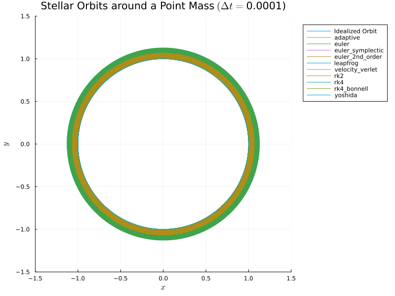{#fig-100}

@fig-100 shows a plot of 100 orbits around a point mass 
for all integrators using a timestep of $\Delta t = 0.0001$.

::: {#fig-change-all layout-ncol=2}
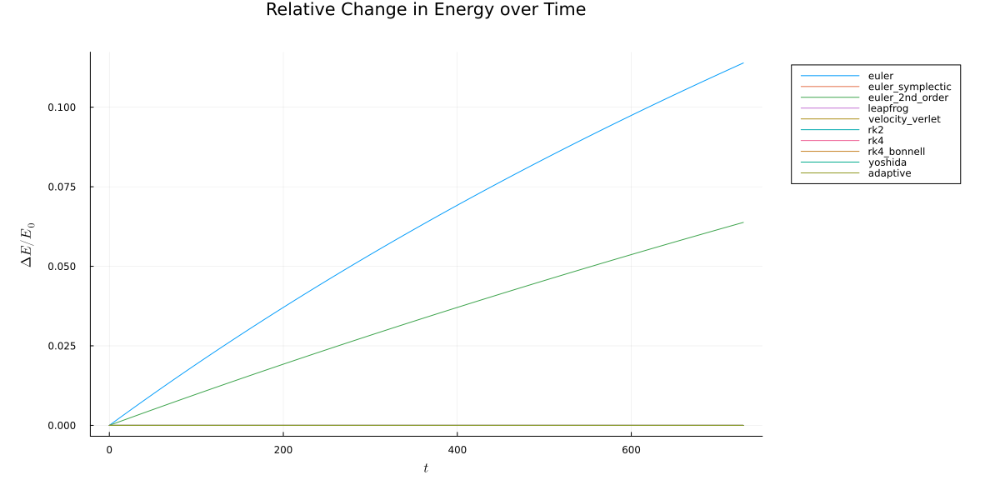{#fig-change-E-all}

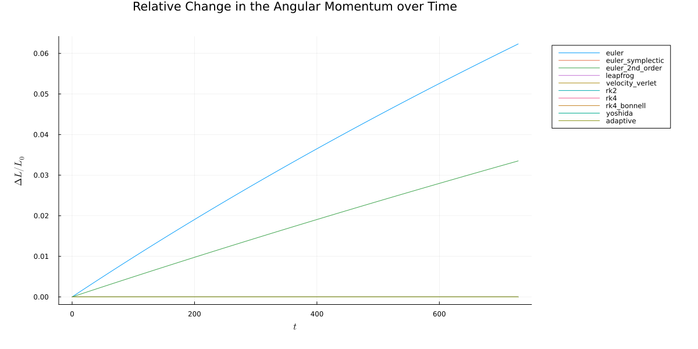{#fig-change-L-all}

Change in the energy and angular momentum for all tested integrators over 100 orbits.
:::

As can be seen in figures @fig-change-E-all and @fig-change-L-all the Eulerian 
and 2^nd^ order Eulerian integrators add energy over time.
They do this to a much higher degree than the rest of the integrators. 

::: {#fig-change-no-euler layout-ncol=2}
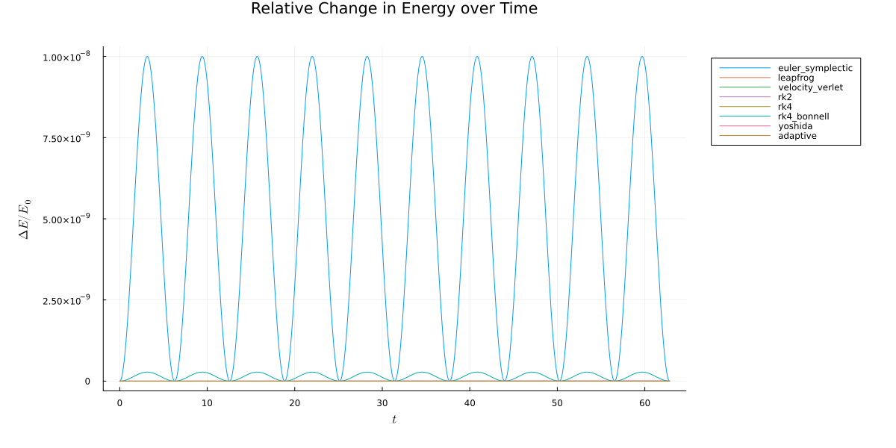{#fig-E-no-euler}

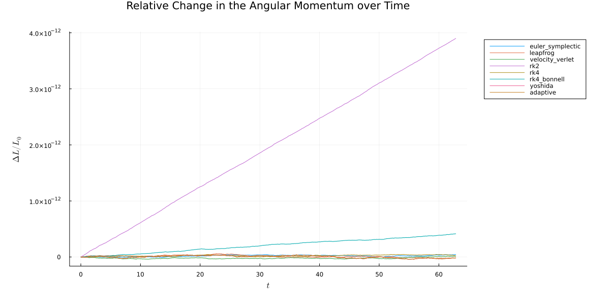{#fig-L-no-euler}

Change in energy and angular momentum over 10 orbits without Euler and 2^nd^ Order Euler integrators.
::: 

@fig-E-no-euler shows how the symplectic Eulerian integrator keeps the 
energy of the system bounded but does not explicitly conserve energy.
@fig-L-no-euler shows the RK2 and the provided RK4 integrators adding
angular momentum over time as well, while the rest of the integrators
keep the angular momentum approximately constant throughout the orbits.
@fig-change-E shows the behavior of the energy for various subsets of the integrators.
One interesting thing to note is that the standard RK4 implementation
loses energy  over time while RK2 adds energy.
I was not aware of this difference between the orders of the 
Runge-Kutta methods.

::: {#fig-change-E layout-ncol=2}

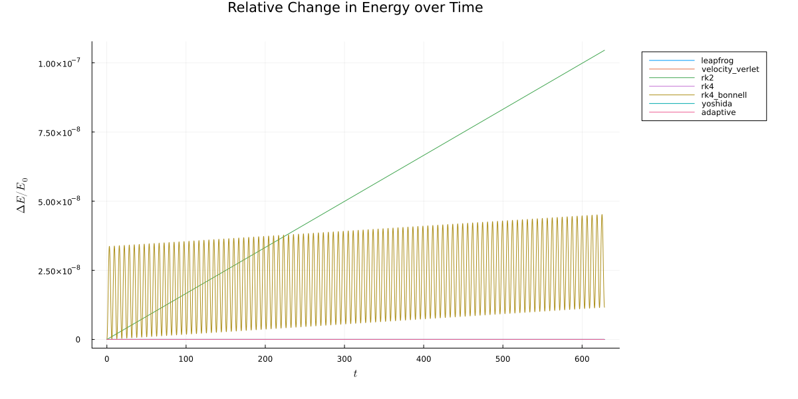{#fig-change-E-rk2-bonnell}

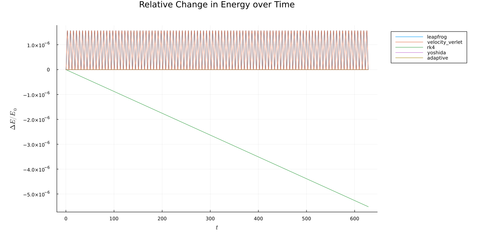{#fig-change-E-rk4 }

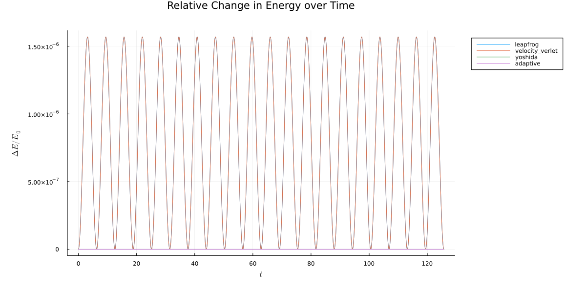{#fig-change-E-frog-vv }

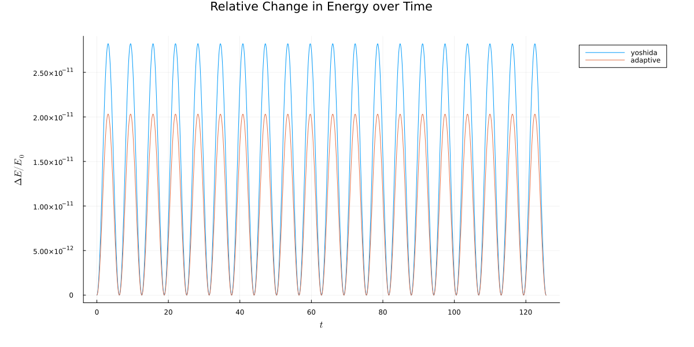{#fig-change-E-yoshi }

Relative change in energy for various subsets of the tested integrators
:::

An interesting point from the tests of the integrators
around the point mass potential, was the different 
biases of the integrators.
These biases were only apparent for large timesteps.
@fig-bad-orbits shows examples of orbits for all the integrators 
with large timesteps.
It is clear to see the integrators that add energy over time as the 
star slowly drifts outward from the point mass.
The symplectic integrators (Symplectic Euler, Leapfrog/Velocity-Verlet, and Yoshida)
all show the bounded behavior of the energy, with the star oscillating
between inner and outer regions.

::: {#fig-bad-orbits layout-ncol=2}

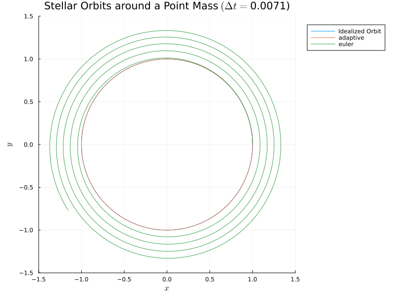{#fig-bad-euler width=75% fig-align="center"}

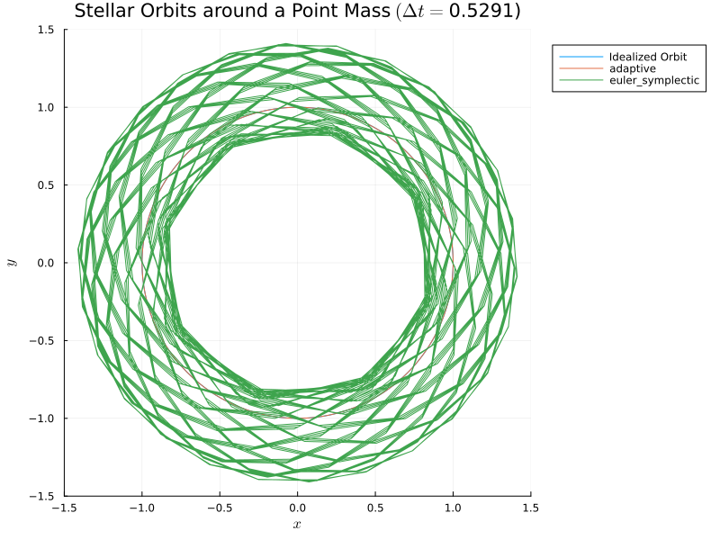{#fig-bad-symp width=75%}

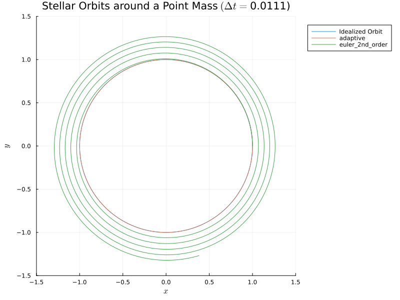{#fig-bad-2nd width=75%}

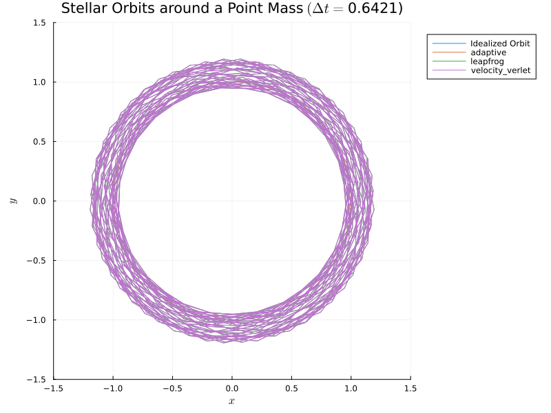{#fig-bad-frog-vv width=75%}

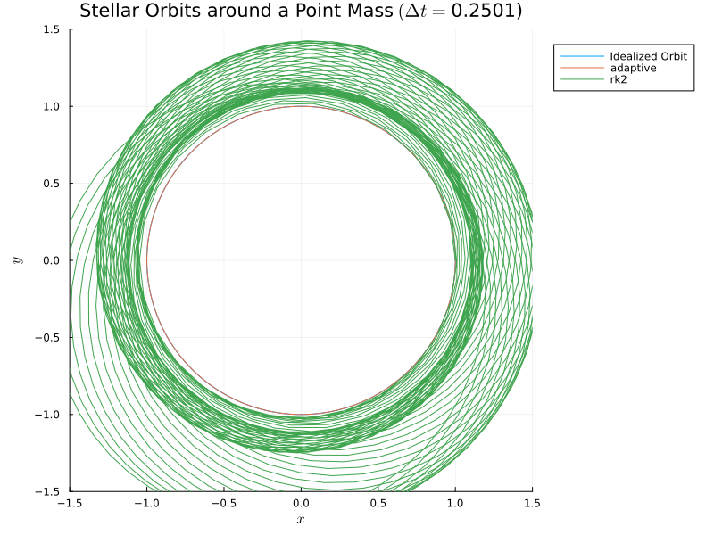{#fig-bad-rk2 width=75%}

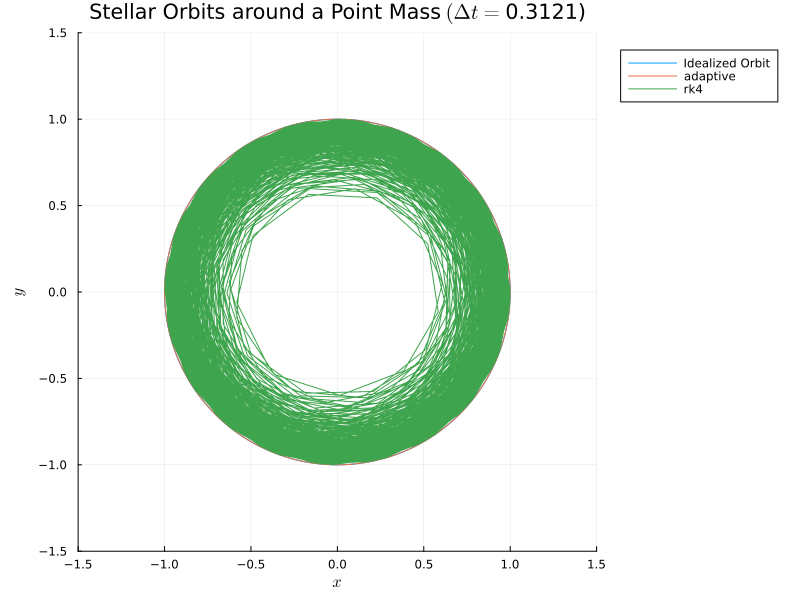{#fig-bad-rk4 width=75%}

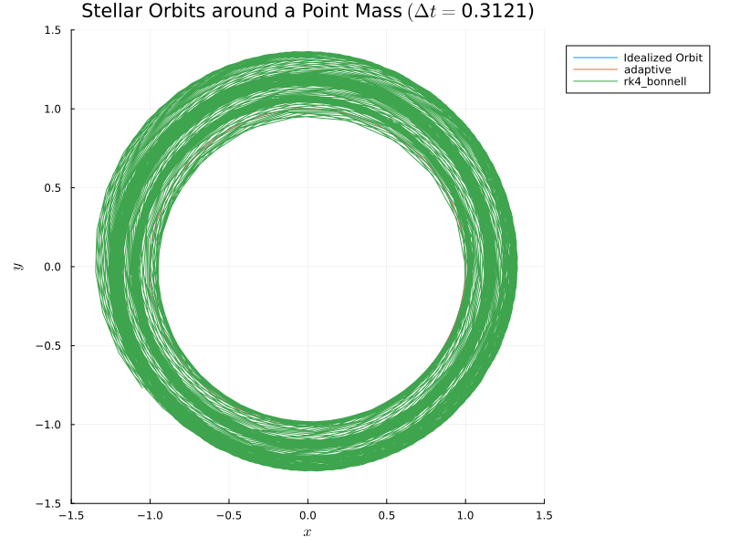{#fig-bad-rk4-bonnell width=75%}

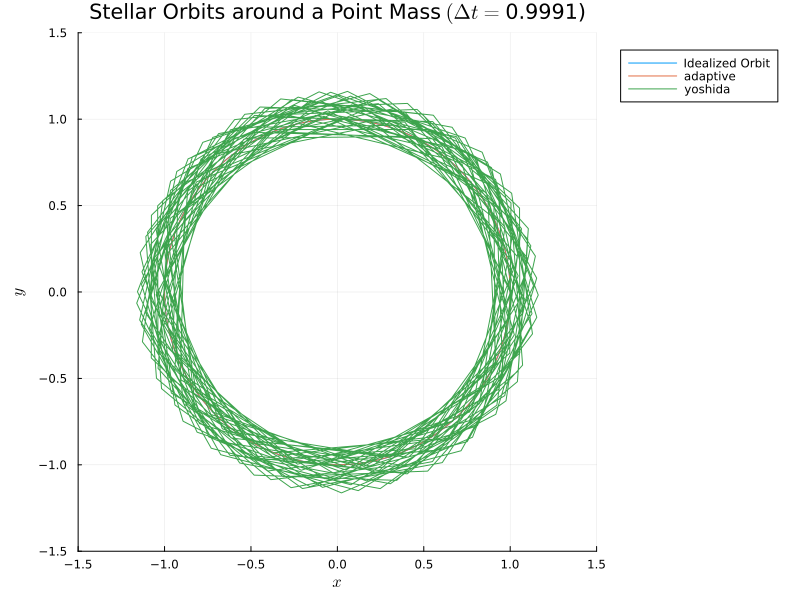{#fig-bad-yoshida width=75%}

Examples of orbits showing the biases in the various integrators.

:::

## Numerical Accuracy

::: {.callout-note title="Numerical Accuracy Instructions"}
Calculate how the error in the integration depends on the timestep used.
:::

Energy and Angular momentum should be conserved throughout the orbits.
So I used those to test the accuracy of the various integrators.
However three of the integrators ran into floating point errors in the change in energy see @fig-err-timestep.
These floating point error regions, and some asymptotic regions, were removed.
The remaining data points were then used to fit the integrator's error dependence on the timestep see @fig-err-timestep-fitted.

::: {#fig-timestep-dependence layout-ncol=2}

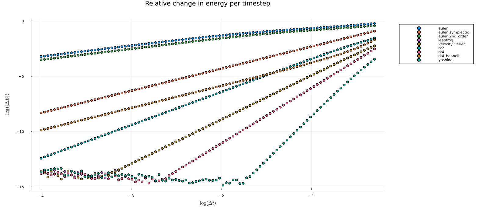{#fig-err-timestep}

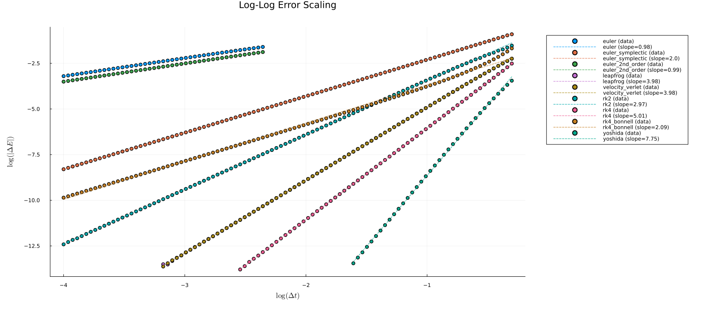{#fig-err-timestep-fitted }

The error dependence on the timestep for all the integrators.
:::

@tbl-error shows the final fitted values for each of the integrators.
However because I used multiple symplectic integrators, which keep the energy bounded, 
this is not the best method to determine the true dependence of the error on the timestep.
But it is useful to show the relative error dependence between the integrators.

| Integrator | Fitted Error Dependence on $\Delta t$ |
|:----------:|:-------------------------------------:|
| Euler             | 0.98                           |
| Symplectic Euler  | 2.00                           |
| 2^nd^ Order Euler | 0.99                           |
| Leapfrog          | 3.98                           |
| Velocity-Verlet   | 3.98                           |
| RK2               | 2.97                           |
| RK4               | 5.01                           |
| Provided RK4      | 2.09                           |
| Yoshida           | 7.75                           |

: Integrators and their error dependence on the timesetp {#tbl-error}

## Timestep to "Break" One Orbit

::: {.callout-note title="\"Break\" One Orbit Instruction"}
Evaluate at what timestep the integration breaks completely on one orbit.
:::

My interpretation of this instruction was to check the difference 
between the initial and final positions after one orbit.
I set a tolerance value that if after one orbit the difference was 
greater than the tolerance I considered the orbit to be "broken".
For each of the integrators I tested one orbit for a range 
of timesteps. 
However this test did not reveal any particularly useful insights.
I set the tolerance to be very high with `tol=1e-4` and even with 
this high of a tolerance all integrators "broke" with a timestep 
barely above $\Delta t = 10^{-4}$.
The only integrators that had a different breaking timestep were 
the basic euler integrator and the 2^nd^ order euler integrator.
@tbl-timestep shows the results of this analysis.

| Integrator | $\Delta t$ to Break One Orbit|
|:----------:|:----------------------------:|
| Euler             | 0.001                 |
| Symplectic Euler  | 0.000153751           |
| 2^nd^ Order Euler | 0.001                 |
| Leapfrog          | 0.000153751           |
| Velocity-Verlet   | 0.000153751           |
| RK2               | 0.000153751           |
| RK4               | 0.000153751           |
| Provided RK4      | 0.000153751           |
| Yoshida           | 0.000153751           |

: Integrators and the timesetp to break one orbit with a tolerance of $0.001$ {#tbl-timestep}

# Orbits in Galactic Potentials

::: {.callout-note title="Galactic Potential Instructions"}
Integrate a number of orbits with different initial conditions $(\vec{r}, \vec{v})$.
Determine if each orbit is a loop orbit or a box orbit.
:::

We now simulate stellar orbits within a logarithmic galactic potential 

\begin{equation}
\Phi_L = 
v_{0}^{2} \ln \left(
R_{c}^{2} + 
x^{2} + 
\frac{y^{2}}{q_{1}^{2}} + 
\frac{z^{2}}{q_{2}^{2}}
\right).
\label{eq:eq-potential}
\end{equation}

## Force Function

First I derived the force experienced by the star from this potential

\begin{align}
m \frac{d \vec{v}}{dt} &= - \nabla \Phi_L \\
&= - \frac{2 v_{0}^{2}}{R_{c}^{2} + x^{2} + y^{2}/q_{1}^{2} + z^{2}/q_{2}^{2}}
\left[
x \hat{x} + 
\frac{1}{q_{1}^{2}} y \hat{y} + 
\frac{1}{q_{2}^{2}} z \hat{z}
\right]
\label{eq:gal-force}
\end{align}

Once I got this function setup I tested it with the 
values of the potential set to $q_1=1.0$, $q_2=1.0$, $R_c=0.2$, and $v_0=1.0$.
I simulated a stellar orbit starting at $x=R_c$ and $v_{y}=v_{0}$.
This produced the circular orbit in @fig-gal-circle.
I then tested this galactic setup for a variety of $x$ and $v_{y}$ values.
Once I confirmed the integration worked with the axisymmetric potential
I changed the initial conditions to have $q_{1}=0.75$, and $q_{2}=0.85$.

::: {#fig-gal-test layout-ncol=2}
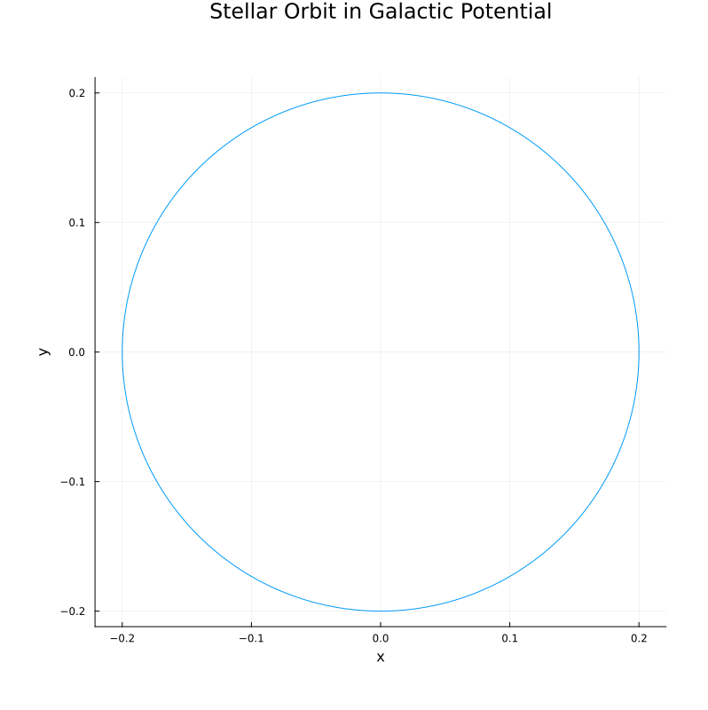{#fig-gal-circle }

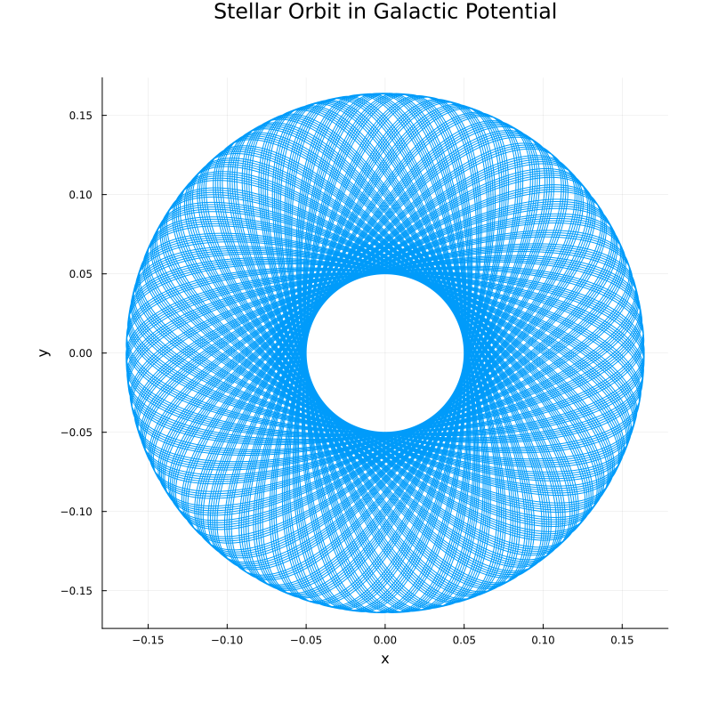{#fig-loop }

![$\mathbf{r}=[3.0, 0.0, 0.0]$, $\mathbf{v}=[0.0, 1.0, 0.0]$ $q_1=0.75$ $q_2=0.85$.](images/loop_orbit_triaxial.png){#fig-loop-asym}

![$\mathbf{r}=[0.05, 0.0, 0.0]$, $\mathbf{v}=[0.0, 1.0, 0.0]$ $q_1=0.75$ $q_2=0.85$.](images/gal_0.05_0.75_0.85.png){#fig-box}

Comparison of orbits in a galactic potential.
:::

I then setup a more systematic "survey" of the various initial conditions
for the stars.
I sampled six values of starting $x$ and $v_{y}$ values to produce the 
orbit survey in @fig-survey.
Each orbit was then classified into either a box or loop orbit 
based on the orbit classfier function discussed in @sec-plane.

{#fig-survey}

## Orbits in the $(r, v_{\mathrm{rot}})$ Plane {#sec-plane}

::: {.callout-note}
Can you determine roughly in the $(r, v_{\mathrm{rot}})$ plane where loop and box orbits are located?
($v_{\mathrm{rot}}$ is the rotational velocity $v_{\mathrm{rot}}=\frac{\vec{v} \times \vec{r}}{r}$)
:::

::: {#fig-loop-vs-box layout-ncol=2 layout-nrow=2}

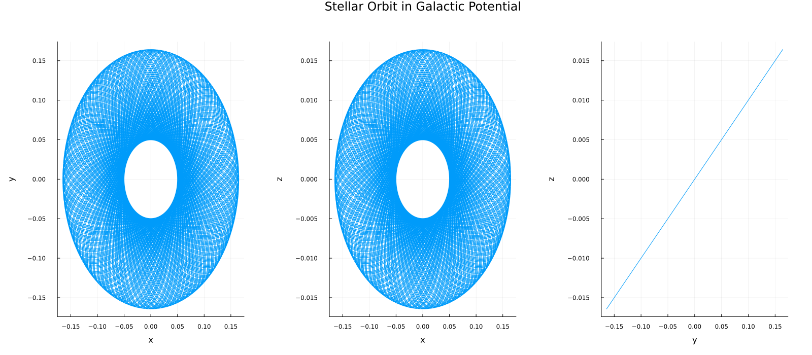

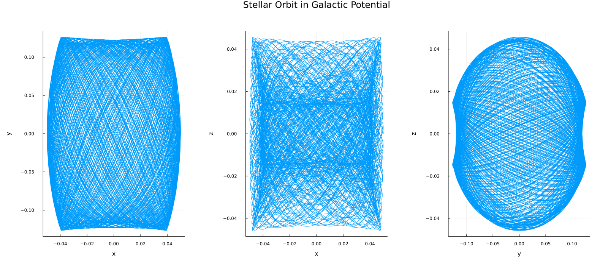

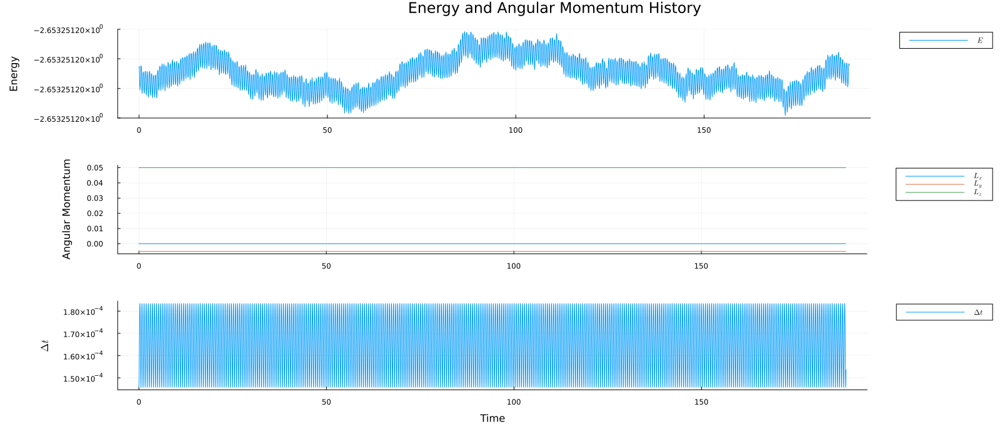

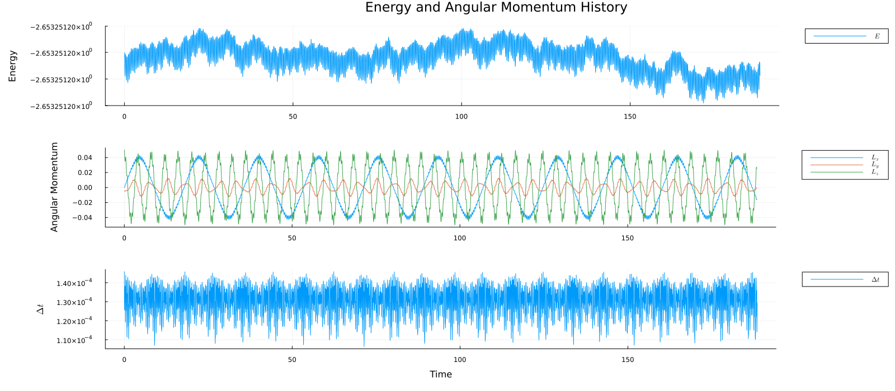

Comparison of box and loop orbits.
The inital conditions are $\mathbf{r}=[0.05, 0, 0]$ and $\mathbf{v}=[0, 1.0, 0.1]$.
The loop orbit comes from a galactic potential with $q_1=q_2=1.0$.
The box orbit comes from a galactic potential with $q_1=0.75$ and $q_2=0.85$.
:::

I wrote a function to determine whether each orbit was a box orbit or a loop orbit.
There were two possible ways of classifying the orbits.
The first was that for a large number of orbits the average angular momentum should be $0$ for a box orbit [@Binney2008_gal_dyn].
Whereas a loop orbit, because it keeps a sense of rotation, the average angular momentum should be some non-zero value.
However, this would involve integrating a very large number of orbits to ensure the average is approximately $0$.
The other option is that the angular momentum changes sign over time in a box orbit.
Thus I created a function that checked that the sign of $L_{z}$ stays constant throughout the orbit.
@fig-loop-vs-box shows two examples of box and loop orbits.
The components of the angular momentum of the loop orbit have the same sign
throughout the orbit. 
The box orbit shows the various components changing sign periodically
throughout the simulation.
Once I had that function working I simulated $10,000$ stars and classified
them as loop or box orbits.
Then I took their initial positions and calculated 
$(r_{0}, v_{\mathrm{rot},0})$ for each of the orbits and plotted them
on a heatmap.
@fig-rvrot-plane shows the results of these orbits.

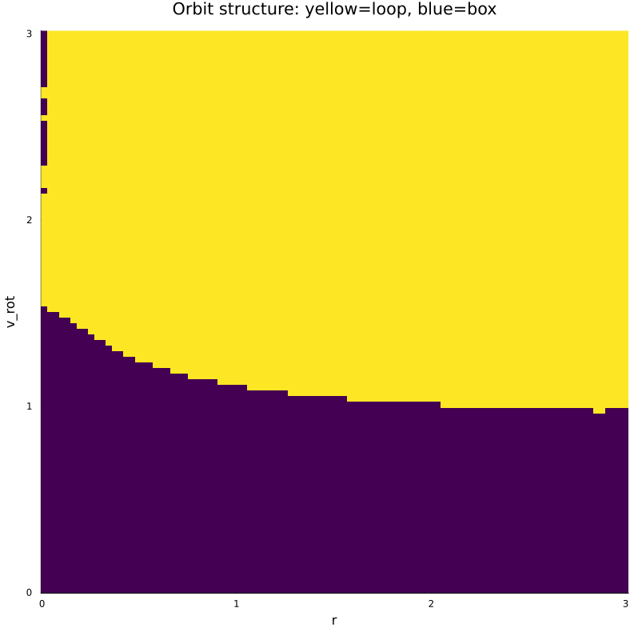{#fig-rvrot-plane}

# References  {.unlisted .unnumbered}

::: {#refs}
:::
