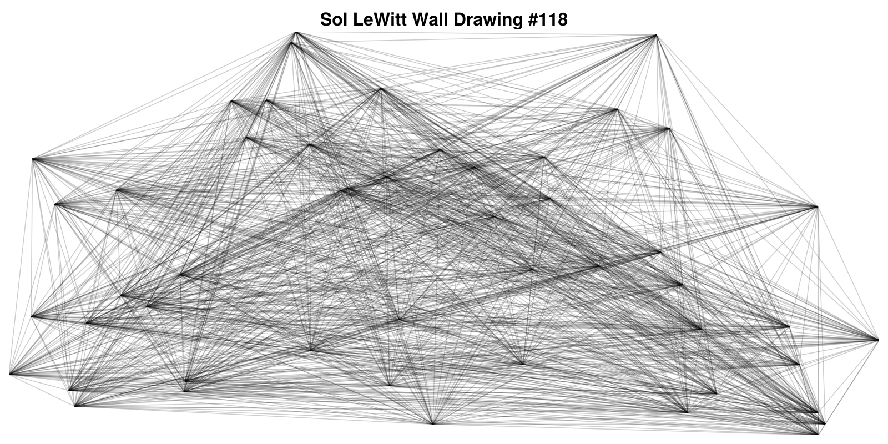
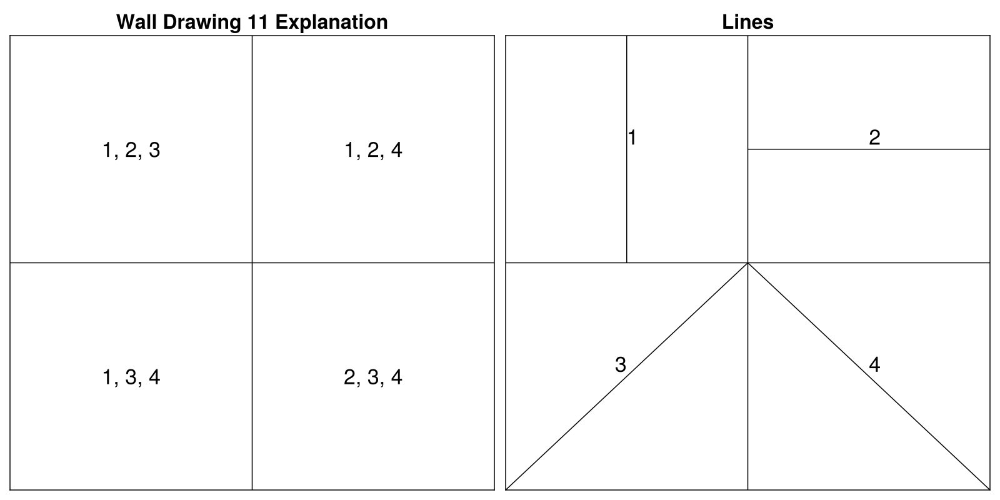
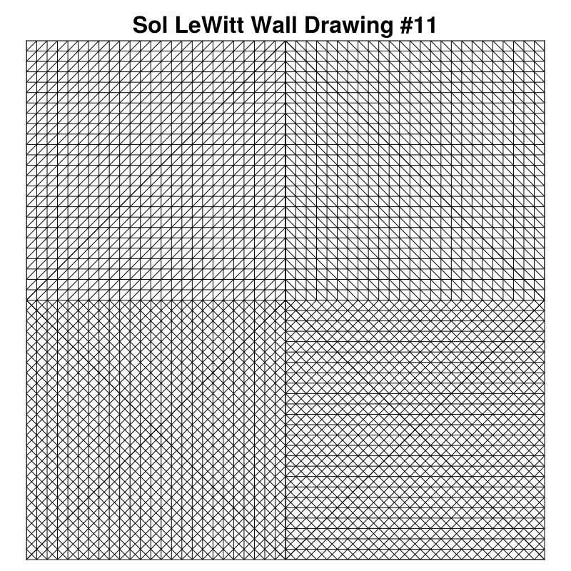
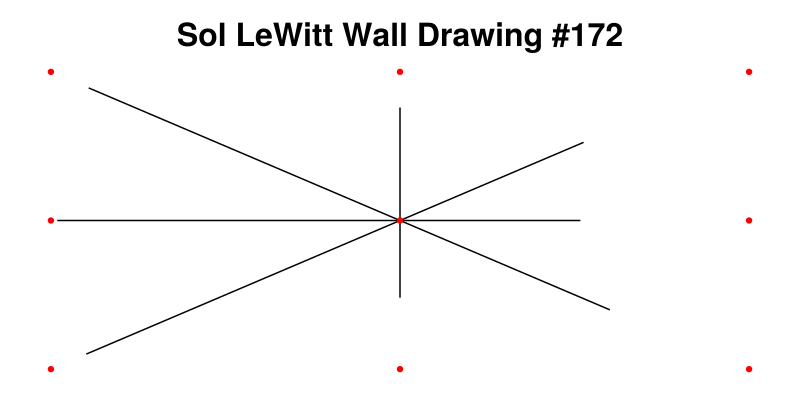

```{julia}
#| echo: false

using CairoMakie, LaTeXStrings, Random;
```

# Sol LeWitt 

Sol LeWitt's Artwork is verycool and interesting.
I first learned about it from [Exploration & Epiphany | Guest video by Paul Dancstep](https://www.youtube.com/watch?v=_BrFKp-U8GI)

I thought this video was really interesting and 
ended up looking into more of his work.

# Wall Drawings
One that really caught my attention were his series of wall drawings.

## Wall Drawing #118
In particular [Wall Drawing #118](https://www.artic.edu/artworks/196148/wall-drawing-118-50-randomly-placed-points-connected-by-straight-lines)
as a unique and beautiful piece.

::: {.callout-note title="Wall Drawing #118"}
> "On a wall surface, any continuous stretch of wall,
> using a hard pencil, place fifty points at random.
> The points should be evenly distributed over the area of the wall.
> All of the points should be connected by straight lines."
> 
> \- Sol LeWitt, 1971
:::

```{julia}
#| echo: false 

wall_drawing_theme = Theme(
    Axis = (
        leftspinevisible = false,
        rightspinevisible = false,
        bottomspinevisible = false,
        topspinevisible = false,
        xticklabelsvisible = false,
        yticklabelsvisible = false,
        xgridcolor = :transparent,
        ygridcolor = :transparent,
        xminortickvisible = false,
        yminortickvisible = false,
        xticksvisible = false,
        yticksvisible = false,
        xautolimitmargin = (0.0,0.0),
        yautolimitmargin = (0.0, 0.0),
        titlesize=32
    )
);
```

```{julia}
function wall_drawing_118()
    fig = Figure(size = (1600, 800))
    ax = Axis(fig[1,1],
                title = "Sol LeWitt Wall Drawing #118")

    points = rand(50, 2)
    for (i, point) in enumerate(eachrow(points))
        for (j, other) in enumerate(eachrow(points))
            if (i == j) || (i > j)
                continue
            else 
                lines!(ax, [point[1], other[1]], [point[2], other[2]],
                        label = "",
                        color = "black",
                        alpha = 0.2)
            end
        end
    end
    save("images/wall_drawing_118.svg", fig)
end;
```

```{julia}
#| echo: false

with_theme(wall_drawing_theme) do 
    wall_drawing_118()
end;
```

::: {#fig-118 .column-screen}



Wall Drawing 118
:::


## Wall Drawing #11

The next drawing that caught my attention was [Wall Drawing #11](https://artgallery.yale.edu/collections/objects/79027).

::: {.callout-note title="Wall Drawing #11"}
> A wall divided horizontally and vertically into four equal parts.
> Within each part, three of the four kinds of lines are superimposed.
> \- Sol LeWitt, 1969
:::

Sol LeWitt had a description of four kinds of lines in his work.
Vertical, horizontal, diagonal up, and diagonal down.
@fig-explain shows an explanation of Wall Drawing #11.

```{julia}
#| echo: false
function wall_drawing_11_explantion()
	fig = Figure(size=(1600, 800))
	ax1 = Axis(fig[1, 1], title="Wall Drawing 11 Explanation",
			   leftspinevisible = true,
        	   rightspinevisible = true,
        	   bottomspinevisible = true,
        	   topspinevisible = true,
			   spinewidth=1.5)
	
	lines!([0.5, 0.5], [0, 1.0], color="black")
	lines!([0, 1.0], [0.5, 0.5], color="black")
	text!(0.25, 0.75, text="1, 2, 3", align=(:center, :center), fontsize=34)
	text!(0.75, 0.75, text="1, 2, 4", align=(:center, :center), fontsize=34)
	text!(0.25, 0.25, text="1, 3, 4", align=(:center, :center), fontsize=34)
	text!(0.75, 0.25, text="2, 3, 4", align=(:center, :center), fontsize=34)

	ax2 = Axis(fig[1, 2], title="Lines",
			   leftspinevisible = true,
        	   rightspinevisible = true,
        	   bottomspinevisible = true,
        	   topspinevisible = true,
			   spinewidth=1.5)
	lines!([0.5, 0.5], [0, 1.0], color="black")
	lines!([0, 1.0], [0.5, 0.5], color="black")

	lines!([0.25, 0.25], [0.5, 1.0], color="black", label="1")
	text!(0.25, 0.75, text="1", fontsize=34)
	lines!([0.5, 1.0], [0.75, 0.75], color="black", label="2")
	text!(0.75, 0.75, text="2", fontsize=34)
	lines!([0.0, 0.5], [0.0, 0.5], color="black", label="3")
	text!(0.25, 0.25, text="3", fontsize=34, align=(:right, :bottom))
	lines!([0.5, 1.0], [0.5, 0.0], color="black", label="4")
	text!(0.75, 0.25, text="4", fontsize=34)

	# Legend(fig[1, 3], ax2)
	
	save("images/wall_drawing_11_explanation.svg", fig)
end;
```

```{julia}
#| echo: false

with_theme(wall_drawing_theme) do
    wall_drawing_11_explantion()
end;
```

::: {#fig-explain}



Explanation of Wall Drawing #11.
It shows the four types of lines and 
the combinations used in the four quadrants.
:::


```{julia}
function wall_drawing_11()
	n_lines = 50
	fig = Figure(size=(800, 800))
	ax = Axis(fig[1, 1], title="Sol LeWitt Wall Drawing #11",
			  leftspinevisible = true,
        	  rightspinevisible = true,
        	  bottomspinevisible = true,
        	  topspinevisible = true,
			  spinewidth=1.0,
			 aspect=1)
	
	lines!([0.5, 0.5], [0, 1.0], color="black", linewidth=1.0)
	lines!([0, 1.0], [0.5, 0.5], color="black", linewidth=1.0)

	function veritcal_lines(start, stop, nlines)
		for x in start:1/n_lines:stop 
			lines!([x, x], [0.5, 1.0], color="black", linewidth=1.0)
		end
	end

	# First quadrant
	for (x, y) in zip(0:1/n_lines:0.5, 0.5:1/n_lines:1.0)
		# Vertical Lines
		lines!([x, x], [0.5, 1.0], color="black", linewidth=1.0)
		# Horizontal Lines
		lines!([0.0, 0.5], [y, y], color="black", linewidth=1.0)
		# Diagonal Up Lines
		# Moving right
		lines!([x, 0.5], [0.5, 1.0 - x], color="black", linewidth=1.0)
		# Moving up
		lines!([0.0, 1.0 - y], [y, 1.0], color="black", linewidth=1.0)
	end

	# Second Quadrant
	for (x, y) in zip(0.5:1/n_lines:1.0, 0.5:1/n_lines:1.0)
		# Vertical Lines
		lines!([x, x], [0.5, 1.0], color="black", linewidth=1.0)
		# Horizontal Lines
		lines!([0.5, 1.0], [y, y], color="black", linewidth=1.0)
		# Diagonal Down Lines
		# Moving Up
		lines!([0.5, x], [y, 0.5], color="black", linewidth=1.0)
		# Moving Right
		lines!([x, 1.0], [1.0, y], color="black", linewidth=1.0)
	end

	# Third Quadrant
	for (x, y) in zip(0.0:1/n_lines:0.5, 0.0:1/n_lines:0.5)
		# Vertical Lines
		lines!([x, x], [0.0, 0.5], color="black", linewidth=1.0)

		# Diagonal Up Lines
		# Moving right
		lines!([x, 0.5], [0.0, 0.5 - x], color="black", linewidth=1.0)
		# Moving up
		lines!([0.0, 0.5 - y], [y, 0.5], color="black", linewidth=1.0)

		
		# Diagonal Down Lines
		# Moving Up
		lines!([0.0, x], [y, 0.0], color="black", linewidth=1.0)
		# Moving Right
		lines!([x, 0.5], [0.5, y], color="black", linewidth=1.0)
	end

	# Fourth Quadrant
	for (x, y) in zip(0.5:1/n_lines:1.0, 0.0:1/n_lines:0.5)
		# Horizontal Lines
		lines!([0.5, 1.0], [y, y], color="black", linewidth=1.0)

		# Diagonal Up Lines
		# Moving right
		lines!([x, 1.0], [0.0, 1.0 - x], color="black", linewidth=1.0)
		# Moving up
		lines!([0.5, 1.0 - y], [y, 0.5], color="black", linewidth=1.0)

		
		# Diagonal Down Lines
		# Moving Up
		lines!([0.5, x], [y, 0.0], color="black", linewidth=1.0)
		# Moving Right
		lines!([x, 1.0], [0.5, y], color="black", linewidth=1.0)
	end

	# for (x, y) in zip(x_vals_first_half, y_vals_second_half)
	# 	lines!([x, 0.5-x], [y, 1.0-y], color="black")
	# end
	# lines!([0.0, 1.0 - y], [y, 0.5], color="black", linewidth=1.0)

	save("images/wall_drawing_11.svg", fig)
end;
```

```{julia}
#| echo: false

with_theme(wall_drawing_theme) do
	wall_drawing_11()
end;
```

::: {#fig-11 .column-screen}



Wall Drawing 11
:::

Test 

## Wall Drawing #172

Picked at random by Sam McDonald.

```{julia}
function wall_drawing_172()
    fig = Figure(size = (800, 400))
    ax = Axis(fig[1,1],
                title = "Sol LeWitt Wall Drawing #172",
             )
    xlims!(ax, -1.1, 1.1)
    ylims!(ax, -1.1, 1.1)

    for i in 1:4 
        scale_l = 0.5*rand()+0.5
        scale_r = 0.5*rand()+0.5

        if i == 1 
            # Horizontal Line
            lines!(ax, [-scale_l, scale_r], [0, 0], color="black")
        elseif i == 2 
            # Vertical Line
            lines!(ax, [0, 0], [-scale_l, scale_r], color="black")
        elseif i == 3 
            # Diagonal Up
            lines!(ax, [-scale_l, scale_r], [-scale_l, scale_r], color="black")
        else 
            # Diagonal Down
            lines!(ax, [-scale_l, scale_r], [scale_l, -scale_r], color="black")
        end
    end

    # Mark Center, Corners, and Midpoints
    for x in [-1,0,1]
        for y in [-1, 0, 1]
            scatter!(ax, [x], [y], color="red")
        end
    end

    save("images/wall_drawing_172.svg", fig)
end;
```

```{julia}
#| echo: false
with_theme(wall_drawing_theme) do 
    wall_drawing_172()
end;
```

::: {#fig-172 .column-screen}



Wall Drawing #172
:::
