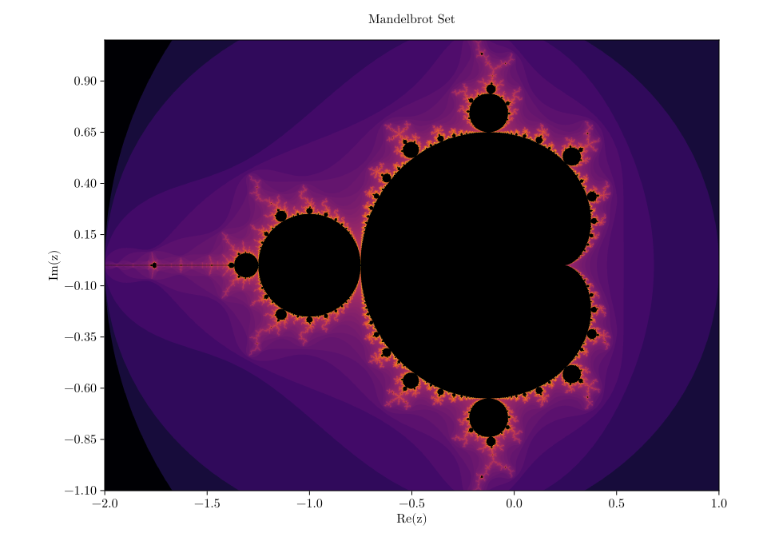
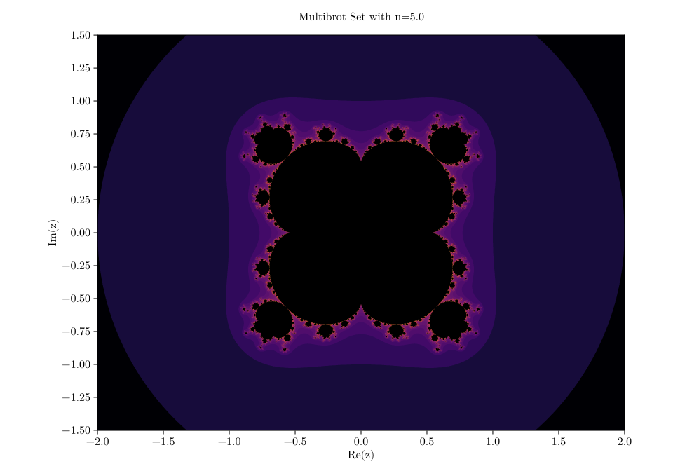

```{julia}
#| echo: false 

using CairoMakie;
```

# General Julia Set

```{julia}
# const C_VAL = complex(-0.7, 0.25)
const C_VAL = complex(-0.512511498387847167, 0.521295573094847167)
const MAX_ITER = 1000
const ESCAPE_RADIUS_SQ = 4.0;
```

```{julia}
function jul(x, y; c=C_VAL, n=2.0)
    z = complex(x, y)
    for i in 1:MAX_ITER
        if abs2(z) > ESCAPE_RADIUS_SQ 
            return Float64(i)
        end
        z = z^n + c 
    end
    return NaN
end;
```

```{julia}
function plot_julia_set(set_func, name;
                        xlims=(-1.5, 1.5), ylims=(-1.0,1.0), res=1e-3,
                        title = "Julia Set with c=$(round(C_VAL, digits=4))"
                        )
    xmin, xmax = xlims 
    ymin, ymax = ylims

    res = 1e-3
    xs = xmin:res:xmax
    ys = ymin:res:ymax

    inch = 96
    pt = 4/3

    fig = Figure(size=(10inch, 7inch), fontsize=12pt)

    Label(fig[1,1],
        title, 
        tellwidth=false)

    ax = Axis(fig[2,1],
            xlabel = "Re(z)",
            ylabel = "Im(z)",
            xticks = xmin:0.5:xmax,
            yticks = ymin:0.25:ymax,
            aspect = DataAspect()
            )

    hm = heatmap!(ax, xs, ys, set_func,
            colormap = :inferno,
            colorscale = log10,
            nan_color = "black",
            rasterize=4.0)

    save(name, fig)
end;
```

```{julia}
with_theme(theme_latexfonts()) do 
    plot_julia_set(jul, "images/julia_set.svg")
end;
```

{#fig-set}

# Mandelbrot Set

```{julia}
mandelbrot(x, y) = jul(x, y; c = complex(x, y));
```

```{julia}
with_theme(theme_latexfonts()) do 
    plot_julia_set(mandelbrot, "images/mandelbrot_set.svg";
                    xlims = (-2.0, 1.0),
                    ylims = (-1.1, 1.1),
                    title = "Mandelbrot Set"
                  )
end;
```

{#fig-mandelbrot}


# Multibrot Sets

```{julia}
new_n(x, y) = jul(x, y; c = complex(x, y), n=5.0);
```

```{julia}
with_theme(theme_latexfonts()) do 
    plot_julia_set(new_n, "images/multibrot_set_3.svg";
                    xlims = (-2.0, 2.0),
                    ylims = (-1.5, 1.5),
                    title = "Multibrot Set with n=$(5.0)"
                  )
end;
```

{#fig-multi}
