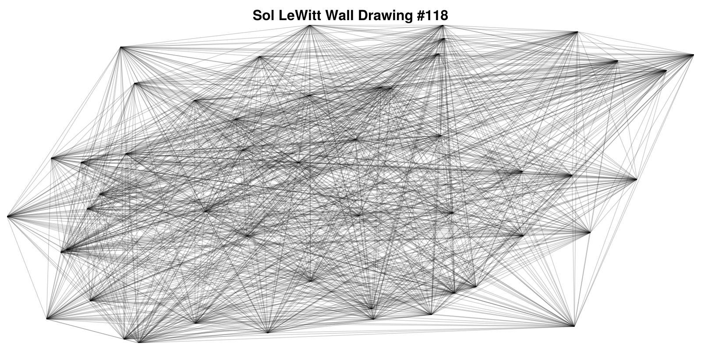

```{julia}
using CairoMakie, LaTeXStrings;
```

# Random

Sol LeWitt's Artwork is verycool and interesting.
I first learned about it from [Exploration & Epiphany | Guest video by Paul Dancstep](https://www.youtube.com/watch?v=_BrFKp-U8GI)

I thought this video was really interesting and 
ended up looking into more of his work.
One that really caught my attention were his series of wall drawings.
In particular [Wall Drawing #118](https://www.artic.edu/artworks/196148/wall-drawing-118-50-randomly-placed-points-connected-by-straight-lines)
as a unique and beautiful piece.

::: {.callout-note title="Wall Drawing #118"}
> "On a wall surface, any continuous stretch of wall,
> using a hard pencil, place fifty points at random.
> The points should be evenly distributed over the area of the wall.
> All of the points should be connected by straight lines."
> 
> \- Sol LeWitt, 1971
:::

```{julia}
wall_drawing_theme = Theme(
    Axis = (
        leftspinevisible = false,
        rightspinevisible = false,
        bottomspinevisible = false,
        topspinevisible = false,
        xticklabelsvisible = false,
        yticklabelsvisible = false,
        xgridcolor = :transparent,
        ygridcolor = :transparent,
        xminortickvisible = false,
        yminortickvisible = false,
        xticksvisible = false,
        yticksvisible = false,
        xautolimitmargin = (0.0,0.0),
        yautolimitmargin = (0.0, 0.0),
        titlesize=32
    )
);
```

```{julia}
function wall_drawing_118()
    fig = Figure(size = (1600, 800))
    ax = Axis(fig[1,1],
                title = "Sol LeWitt Wall Drawing #118")

    points = rand(50, 2)
    for (i, point) in enumerate(eachrow(points))
        for (j, other) in enumerate(eachrow(points))
            if (i == j) || (i > j)
                continue
            else 
                lines!(ax, [point[1], other[1]], [point[2], other[2]],
                        label = "",
                        color = "black",
                        alpha = 0.2)
            end
        end
    end
    save("images/wall_drawing_118.svg", fig)
end;
```

```{julia}
with_theme(wall_drawing_theme) do 
    wall_drawing_118()
end;
```

{#fig-118}

